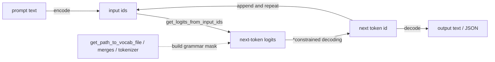

*This project has been created as part of the 42 curriculum by diosoare.*

# Call_Me_Maybe

## Description

Call Me Maybe is a function-calling project that translates natural-language prompts into structured, machine-executable function calls. Given a set of available function definitions and a set of prompts, the objective is to identify the correct function to call, extract its arguments with the correct types, and emit valid JSON output for every processed request.

The program uses a **small causal text-generation LLM from Hugging Face** through a provided SDK and relies on **constrained decoding**: a token-by-token selection strategy that restricts the model's next-token choices to values that preserve both **syntactic validity** and **schema compatibility**. This guarantees robust output even with a lightweight model. The project accepts any Hugging Face model repository ID via the `--model` CLI flag. The default model is `Qwen/Qwen3-0.6B`; selected checkpoints must be compatible with `AutoModelForCausalLM` and the current GPT-2-style vocabulary decoding path.

The LLM is only used to choose the function name and generate argument values; the surrounding JSON object is assembled in Python, so invalid syntax is never possible.

## Instructions

### Requirements

- Python 3.10+
- [uv](https://docs.astral.sh/uv/) for dependency management
- A Hugging Face account token in `.env` (`HF_TOKEN=...`) - optional

### Install

```bash
make install
# equivalent to: uv sync
```

### Run

```bash
make run
# equivalent to: uv run python -m src
```

To pass command-line options:

```bash
(.venv)uv run python -m src --model Qwen/Qwen3-0.6B
```

On first run, the selected model (default `Qwen/Qwen3-0.6B`) is downloaded from Hugging Face and cached locally. Subsequent runs will use the cached model directly.

By default the program reads `src/data/input/functions_definition.json` and `src/data/input/function_calling_tests.json`, and writes `src/data/output/function_calling_results.json`. The model can also be changed at runtime with `--model`, and every path can be overridden:

```bash
(.venv)uv run python -m src \
  --model Qwen/Qwen3-0.6B \
  --functions_definition src/data/input/functions_definition.json \
  --input src/data/input/function_calling_tests.json \
  --output src/data/output/function_calling_results.json
```

Example with a different Hugging Face text-generation model:

```bash
uv run python -m src --model Qwen/Qwen3-1.7B
```

The `--model` flag accepts any Hugging Face repository ID (e.g., `--model Qwen/Qwen3-0.6B` or `Qwen/Qwen3-1.7B`):
- Model weights, tokenizer, and configuration files are downloaded from the Hugging Face Hub and cached locally under `~/.cache/huggingface/hub`.
- For private or gated models, the `HF_TOKEN` from `.env` is automatically used.

### Other Makefile targets

- `make debug` - runs the program under `pdb`
- `make lint` - runs `flake8` and `mypy`
- `make lint-strict` - runs `flake8` and `mypy --strict`
- `make clean` - removes the virtual environment, generated output, and caches

## Project structure

```text
Call_Me_Maybe/
├── .env.example
├── .gitignore
├── Makefile
├── README.md
├── pyproject.toml
├── uv.lock
└── src/
    ├── __init__.py
    ├── __main__.py            # CLI entry point (python -m src)
    ├── classes/
    │   ├── __init__.py
    │   ├── config.py          # Init (env + CLI args), CliArgs
    │   ├── decoder.py         # ConstrainedDecoder
    │   ├── engine.py          # FunctionCallEngine
    │   └── models.py          # FunctionDefinition, FunctionCallResult, Vocabulary
    ├── data/
    │   ├── input/
    │   │   ├── function_calling_tests.json
    │   │   └── functions_definition.json
    │   └── output/            # generated at runtime
    └── llm_sdk/
        └── llm_sdk/
        ├── __init__.py    # Small_LLM_Model
        ├── pyproject.toml
        └── uv.lock
```

`src/classes` contains the application models and pipeline components: the input/output schemas (`FunctionDefinition`, `FunctionCallResult`), vocabulary wrapper, constrained decoder, engine, and configuration (`Init`, `CliArgs`). `src/data/input` stores the function definitions and prompts; `src/data/output` is generated at runtime and excluded from version control. `src/llm_sdk` is a separately packaged local SDK used to load and run the Hugging Face model.

## Small_LLM API

The `llm_sdk` package wraps the Hugging Face model behind a small, fixed set of methods:

- `encode(text)` - tokenizes a string into input ids.
- `decode(ids)` - converts token ids back into a string.
- `get_logits_from_input_ids(input_ids)` - returns the raw next-token logits for a given sequence.
- `get_path_to_vocab_file()` - downloads and returns the local path to the model's vocab file.
- `get_path_to_merges_file()` - downloads and returns the local path to the model's BPE merges file.
- `get_path_to_tokenizer_file()` - downloads and returns the local path to the model's tokenizer file.

---

## Autoregressive generation loop



## Algorithm Explanation

The pipeline never asks the LLM to produce raw JSON text. Instead, it asks the model, one constrained field at a time, to choose or generate the individual pieces of the answer, and Python assembles those pieces into the final `FunctionCallResult`. This removes the JSON-syntax failure mode entirely: the model can only ever influence *values*, never brackets, quotes, or commas.

1. **Vocabulary** (`classes/models.py::Vocabulary`) downloads `vocab.json` through `get_path_to_vocab_file()` and decodes every entry out of GPT-2's byte-level BPE alphabet back into real UTF-8 text, producing an `id_to_token` map used by every decoding step below. A `numeric_token_ids` subset is precomputed to speed up number generation.

2. **Function selection** (`ConstrainedDecoder.select_function_name`) builds a prompt listing every available function and its description, then constrained-decodes the answer token by token: at each step, the logits of every token whose text would not keep the generated string a prefix of at least one real function name are masked to `-inf`, and `numpy.argmax` picks the survivor (`_generate_enum`). Generation stops when the partial string exactly matches one valid function name.

3. **Parameter generation** (`ConstrainedDecoder.generate_parameters`) walks the chosen function's parameter schema in order. For each parameter, a short sub-prompt asking for that specific value is appended to the running token sequence, and the value is generated under a type-specific constraint, always via the same mask-then-`argmax` pattern:
   - `number` - only tokens that keep the partial string a valid integer/float prefix are left unmasked (`_generate_number`); generation stops as soon as the model's own unconstrained top choice would break the number format.
   - anything else (`string`) - every token is left unmasked except ones containing `"` or a newline, so the value can never break out of its JSON string boundary (`_generate_string`). Since this validity check never depends on what has been generated so far, the safe-token-id mask is built once per decoder and cached, instead of being recomputed on every step.

4. **Assembly** (`FunctionCallEngine`) wraps the selected name and the generated parameters, together with the original prompt, into a `FunctionCallResult` pydantic model, which is what actually guarantees 100% valid, schema-shaped JSON on `write_output()` - the LLM never has a chance to emit invalid structure because it is never asked to emit structure at all.

At every step, logits come from `get_logits_from_input_ids`, and the same sequence of token IDs keeps growing across function-name selection and every parameter, so later fields retain the original request and previously generated values.

## Design Decisions

- **Constrain values, not syntax.** Rather than building a general JSON-schema grammar engine, each field type gets its own small, well-understood constraint (enum trie, numeric-prefix regex, quote/newline exclusion). This keeps the decoder small and auditable while still satisfying the requirement that function and argument choice come from the model's own logits, not from string-matching the prompt.
- **Mask with `numpy`** Every constrained step builds a full-length logits array, sets every invalid token's score to `-inf`, and calls `numpy.argmax` to pick the survivor. An explicit `numpy.isfinite(...).any()` check guards the case where masking leaves nothing valid, since `argmax` on an all-`-inf` array would otherwise silently return index 0.
- **Everything is a pydantic `BaseModel`.** `FunctionDefinition`, `FunctionCallResult`, `Vocabulary`, `ConstrainedDecoder`, `FunctionCallEngine`, `Init`, and `CliArgs` are all pydantic models. Fields holding non-pydantic objects (the LLM instance) use `model_config = ConfigDict(arbitrary_types_allowed=True)`.
- **One class package (`src/classes/`).** Models, the vocabulary, the decoder, the engine, and configuration all live together, so the module tree mirrors the pipeline: `config -> models -> decoder -> engine`.
- **`src/__main__.py` has exactly one function (`main`).** Argument parsing, environment loading, and path resolution are methods on `Init`; the engine and decoder do the rest. `main()` only wires the pieces together and reports errors.
- **Three-tier error handling in `main()`**: `pydantic.ValidationError` (bad function-definition schema, reported field by field), `(OSError, ValueError)` (missing files, invalid JSON, empty definitions), and a final catch-all so the program never crashes without a message.
- **No direct `torch`/`transformers` imports in `src/`.** Everything routes through the provided `Small_LLM_Model` SDK's public methods only, never its private attributes.

## Performance Analysis

On the provided `function_calling_tests.json` (12 prompts, 5 declared functions), the pipeline produces:

- **100% valid JSON** on every run - guaranteed structurally, since the JSON object is assembled in Python from typed values, never parsed out of raw model output.
- **Model-dependent semantic accuracy**: the default `Qwen/Qwen3-0.6B` correctly routed the supplied prompts in a verified run, but regex values remain model-generated and should be evaluated for meaning, not only syntax. Constrained decoding does not guarantee that a valid regex expresses the user's intent.
- **Runtime**: a full run over all 12 prompts on CPU is dominated by repeated `get_logits_from_input_ids` forward passes. Vectorized `numpy` masking is a minor contributor, and numeric fields narrow the scan to the precomputed `numeric_token_ids` subset instead of the full vocabulary.
- **Reliability**: missing input files, malformed JSON, and schema-invalid function definitions are all caught explicitly and reported with a clear message and a non-zero exit code, without a traceback.

### Model Selection

Constrained decoding guarantees valid function names, value types, and JSON structure, but it cannot supply semantic understanding that is absent from the model's logits. In testing, the default `Qwen/Qwen3-0.6B` was substantially more reliable than several smaller sub-0.6B checkpoints tried, `HuggingFaceTB/SmolLM2-135M` among them, which often confused numeric text inside a string with an arithmetic request. This suggests that an instruction-tuned model in the roughly 0.5B-0.6B range is a practical minimum for varied function-calling prompts in this setup. Smaller or base-only models may still work for narrow tasks, but reliable results may require deterministic post-processing, task-specific fine-tuning, or a larger instruction-tuned checkpoint.

## Challenges Faced

- **Decoding `vocab.json` into real text.** The vocabulary file maps token strings to ids using GPT-2's byte-level BPE alphabet, where bytes like spaces and newlines are remapped to printable unicode characters (e.g. leading space becomes `Ġ`) so every token can be stored as valid JSON text. This byte-to-unicode scheme originates from OpenAI's GPT-2 tokenizer and is reused across the ecosystem, including Hugging Face's `transformers`, so the SDK's `get_path_to_vocab_file()` only returns the raw file - it does not resolve tokens back to readable text. Determining which tokens are valid continuations required implementing the standard reverse mapping ourselves, to recover the actual text each token represents.
- **Knowing when a free-form field is "done".** Enum-style fields (the function name) have a natural stopping point: the generated text exactly matches a candidate. Numbers and strings don't. The solution: peek at the model's own unconstrained top choice at each step, and stop as soon as that top choice would break the field's format (a non-digit after a number, a quote or newline inside a string), letting the model signal its own completion instead of relying on a hardcoded length.
- **Disambiguating multiple parameters of the same type.** For prompts like "sum of 265 and 345", the two numeric parameters could not be generated from independent, context-free prompts without the model repeating the first value. The fix was to keep extending the same growing token sequence across parameters, so each field's sub-prompt is appended after the previous field's generated answer, giving the model the context it needs.
- **Stray leading quote characters.** Values generated for `string` parameters occasionally began with the same quote character used in the natural language prompt (e.g. `'hello` instead of `hello`). Trimming `'`/`"`/whitespace from both ends of the generated string resolved it without touching the constrained-decoding logic itself.

## Testing Strategy

- **End-to-end runs** against the provided `functions_definition.json` and `function_calling_tests.json`, inspecting `function_calling_results.json` for valid JSON, correct `name`, and correctly typed `parameters` on every entry.
- **Negative-path testing**: pointing `--functions_definition` at a missing file, and at a file with a function entry missing required fields (`name` only, no `description`/`parameters`/`returns`), to confirm the program exits with code 1 and a readable message instead of a traceback.
- **Static checks**: `make lint` (flake8 + mypy with `--disallow-untyped-defs --check-untyped-defs`) run after every change.
- **CLI override checks**: running with `--input`/`--output`/`--functions_definition` pointed at alternate paths to confirm the flags take precedence over the defaults.

## Example Usage

On 42 school machines, redirect caches and the virtualenv away from the home directory quota:

```bash
export XDG_CACHE_HOME="/goinfre/$USER/.cache"
export UV_CACHE_DIR="/goinfre/$USER/.cache"
export UV_PROJECT_ENVIRONMENT="/goinfre/.venv-call-me-maybe"
```

Run with the default, bundled test data:

```bash
uv run python -m src
```

Run against custom files:

```bash
uv run python -m src \
  --model Qwen/Qwen3-0.6B \
  --functions_definition path/to/functions_definition.json \
  --input path/to/prompts.json \
  --output path/to/results.json
```

Run with a specific Hugging Face model:

```bash
uv run python -m src --model Qwen/Qwen3-1.7B
```

Given this prompt in `function_calling_tests.json`:

```json
{"prompt": "What is the sum of 265 and 345?"}
```

and this entry in `functions_definition.json`:

```json
{
  "name": "fn_add_numbers",
  "description": "Add two numbers together and return their sum.",
  "parameters": {"a": {"type": "number"}, "b": {"type": "number"}},
  "returns": {"type": "number"}
}
```

the program writes the following into `function_calling_results.json`:

```json
{
  "prompt": "What is the sum of 265 and 345?",
  "name": "fn_add_numbers",
  "parameters": {"a": 265.0, "b": 345.0}
}
```

## Resources

**1) How LLMs generate text, token by token**

- Hugging Face Learn - [https://huggingface.co/learn](https://huggingface.co/learn)
- OpenAI Cookbook - [https://cookbook.openai.com/](https://cookbook.openai.com/)

**2) Tokenization**

- Hugging Face Tokenizers docs - [https://huggingface.co/docs/tokenizers/index](https://huggingface.co/docs/tokenizers/index)
- Microsoft token fundamentals - [https://learn.microsoft.com/en-us/dotnet/ai/conceptual/understanding-tokens](https://learn.microsoft.com/en-us/dotnet/ai/conceptual/understanding-tokens)

**3) What function calling means for LLMs**

- OpenAI function calling - [https://platform.openai.com/docs/guides/function-calling](https://platform.openai.com/docs/guides/function-calling)
- Anthropic tool use - [https://docs.anthropic.com/en/docs/agents-and-tools/tool-use/overview](https://docs.anthropic.com/en/docs/agents-and-tools/tool-use/overview)
- Google Gemini function calling - [https://ai.google.dev/gemini-api/docs/function-calling](https://ai.google.dev/gemini-api/docs/function-calling)

**4) JSON and JSON Schema validation**

- JSON standard (RFC 8259) - [https://www.rfc-editor.org/rfc/rfc8259](https://www.rfc-editor.org/rfc/rfc8259)
- JSON Schema official docs - [https://json-schema.org/learn/getting-started-step-by-step](https://json-schema.org/learn/getting-started-step-by-step)
- Python json module - [https://docs.python.org/3/library/json.html](https://docs.python.org/3/library/json.html)
- Pydantic docs - [https://docs.pydantic.dev/](https://docs.pydantic.dev/)

**5) Constrained (grammar-guided) decoding**

- OpenAI Structured Outputs - [https://platform.openai.com/docs/guides/structured-outputs](https://platform.openai.com/docs/guides/structured-outputs)
- Hugging Face text generation docs - [https://huggingface.co/docs/transformers/main/en/main_classes/text_generation](https://huggingface.co/docs/transformers/main/en/main_classes/text_generation)

**6) Python fundamentals this project enforces**

- Python tutorial - [https://docs.python.org/3/tutorial/](https://docs.python.org/3/tutorial/)
- Python typing - [https://docs.python.org/3/library/typing.html](https://docs.python.org/3/library/typing.html)
- Python dataclasses - [https://docs.python.org/3/library/dataclasses.html](https://docs.python.org/3/library/dataclasses.html)
- Python exceptions - [https://docs.python.org/3/tutorial/errors.html](https://docs.python.org/3/tutorial/errors.html)

**7) Project tools: uv and Makefile**

- uv docs (Astral) - [https://docs.astral.sh/uv/](https://docs.astral.sh/uv/)
- GNU Make manual - [https://www.gnu.org/software/make/manual/make.html](https://www.gnu.org/software/make/manual/make.html)
- Python Packaging User Guide (PyPA) - [https://packaging.python.org/](https://packaging.python.org/)

**How AI was used on this project**

An AI coding assistant (GitHub Copilot Chat, mostly using Claude Sonnet 5 model) was used throughout development for:

- Scaffolding the initial pydantic class structure (`FunctionDefinition`, `FunctionCallResult`, `Vocabulary`, `ConstrainedDecoder`, `FunctionCallEngine`).
- Implementing and explaining the GPT-2 byte-level BPE reverse mapping needed to decode `vocab.json` into real token text.
- Running the pipeline end-to-end and checking lint (`flake8`, `mypy`) after every change.
- Drafting and iterating on this README.
