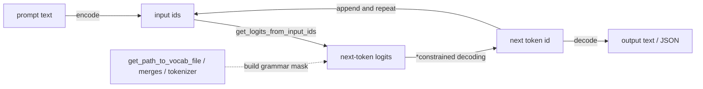

*This project has been created as part of the 42 curriculum by diosoare.*

# Call_Me_Maybe

## Description

Call Me Maybe is a function calling project that translates natural language prompts into structured, machine-executable function calls. Given a set of available function definitions and a set of natural language prompts, the goal is to identify the correct function to call and extract its arguments with the correct types, producing valid JSON output for every single prompt.

The program uses a **small local LLM** (Qwen/Qwen3-0.6B) through a provided SDK, and relies on **constrained decoding** - a token-by-token generation technique that restricts the model's next-token choices to only those that keep the output both **syntactically valid JSON** and compliant with the expected function schema - to guarantee 100% valid, parseable output even from an unreliable, low-parameter model. The LLM is only ever used to choose the function name and generate each argument value; the surrounding JSON object is assembled in Python, so invalid syntax is never possible.

## Instructions

### Requirements

- Python 3.10+
- [uv](https://docs.astral.sh/uv/) for dependency management
- A Hugging Face account token in `.env` (`HF_TOKEN=...`), optional but speeds up model downloads

### Install

```bash
make install
# equivalent to: uv sync
```

### Run

```bash
make run
# equivalent to: uv run python -m src
```

By default the program reads `src/data/input/functions_definition.json` and `src/data/input/function_calling_tests.json`, and writes `src/data/output/function_calling_results.json`. Every path can be overridden:

```bash
uv run python -m src \
  --functions_definition src/data/input/functions_definition.json \
  --input src/data/input/function_calling_tests.json \
  --output src/data/output/function_calling_results.json
```

### Other Makefile targets

- `make debug` - runs the program under `pdb`
- `make lint` - runs `flake8` and `mypy`
- `make lint-strict` - runs `flake8` and `mypy --strict`
- `make clean` - removes the virtual environment, generated output, and caches

## Project structure

```text
Call_Me_Maybe/
├── .env.example
├── .gitignore
├── Makefile
├── README.md
├── pyproject.toml
├── uv.lock
└── src/
    ├── __init__.py
    ├── __main__.py            # CLI entry point (python -m src)
    ├── classes/
    │   ├── config.py          # Init (env + CLI args), CliArgs
    │   ├── constants.py       # shared regex constants
    │   ├── decoder.py         # ConstrainedDecoder
    │   ├── engine.py          # FunctionCallEngine
    │   └── models.py          # FunctionDefinition, FunctionCallResult, Vocabulary
    ├── data/
    │   ├── input/
    │   │   ├── function_calling_tests.json
    │   │   └── functions_definition.json
    │   └── output/            # generated at runtime
    └── llm_sdk/
        └── llm_sdk/
            └── __init__.py    # Small_LLM_Model
```

`src/classes` holds every pydantic model in the project: the input/output schemas (`FunctionDefinition`, `FunctionCallResult`), the vocabulary wrapper, the constrained decoder, the engine that orchestrates the whole pipeline, and configuration (`Init`, `CliArgs`). `src/data/input` stores the evaluation cases and function definitions; `src/data/output` is generated on each run and excluded from version control. `src/llm_sdk` is the provided SDK used to connect to the local model.

## Small_LLM API

The `llm_sdk` package wraps the Hugging Face model behind a small, fixed set of methods:

- `encode(text)` - tokenizes a string into input ids.
- `decode(ids)` - converts token ids back into a string.
- `get_logits_from_input_ids(input_ids)` - returns the raw next-token logits for a given sequence.
- `get_path_to_vocab_file()` - downloads and returns the local path to the model's vocab file.
- `get_path_to_merges_file()` - downloads and returns the local path to the model's BPE merges file.
- `get_path_to_tokenizer_file()` - downloads and returns the local path to the model's tokenizer file.

---

## Autoregressive generation loop



## Algorithm Explanation

The pipeline never asks the LLM to produce raw JSON text. Instead, it asks the model, one constrained field at a time, to choose or generate the individual pieces of the answer, and Python assembles those pieces into the final `FunctionCallResult`. This removes the JSON-syntax failure mode entirely: the model can only ever influence *values*, never brackets, quotes, or commas.

1. **Vocabulary** (`classes/models.py::Vocabulary`) downloads `vocab.json` through `get_path_to_vocab_file()` and decodes every entry out of GPT-2's byte-level BPE alphabet back into real UTF-8 text, producing an `id_to_token` map used by every decoding step below. A `numeric_token_ids` subset is precomputed to speed up number generation.

2. **Function selection** (`ConstrainedDecoder.select_function_name`) builds a prompt listing every available function and its description, then constrained-decodes the answer token by token: at each step, only tokens whose text keeps the generated string a prefix of at least one real function name are considered, and the highest-logit token among those survivors is chosen (`_generate_enum`). Generation stops the moment the partial string exactly matches one function name.

3. **Parameter generation** (`ConstrainedDecoder.generate_parameters`) walks the chosen function's parameter schema in order. For each parameter, a short sub-prompt asking for that specific value is appended to the running token sequence, and the value is generated under a type-specific constraint:
   - `number` - only tokens that keep the partial string a valid integer/float prefix are allowed (`_generate_number`); generation stops as soon as the model's own unconstrained top choice would break the number format.
   - `boolean` - decoded the same way as the function name, restricted to the two-item enum `["true", "false"]`.
   - anything else (`string`) - every token is allowed except ones containing `"` or a newline, so the value can never break out of its JSON string boundary (`_generate_string`).

4. **Assembly** (`FunctionCallEngine`) wraps the selected name and the generated parameters, together with the original prompt, into a `FunctionCallResult` pydantic model, which is what actually guarantees 100% valid, schema-shaped JSON on `write_output()` - the LLM never has a chance to emit invalid structure because it is never asked to emit structure at all.

At every step, logits come from `get_logits_from_input_ids`, and the same sequence of token ids keeps growing across function-name selection and every parameter, so later fields are generated with full knowledge of the original request and all previously generated values.

## Design Decisions

- **Constrain values, not syntax.** Rather than building a general JSON-schema grammar engine, each field type gets its own small, well-understood constraint (enum trie, numeric-prefix regex, quote/newline exclusion). This keeps the decoder small and auditable while still satisfying the requirement that function and argument choice come from the model's own logits, not from string-matching the prompt.
- **Everything is a pydantic `BaseModel`.** `FunctionDefinition`, `FunctionCallResult`, `Vocabulary`, `ConstrainedDecoder`, `FunctionCallEngine`, `Init`, and `CliArgs` are all pydantic models. Fields holding non-pydantic objects (the LLM instance) use `model_config = ConfigDict(arbitrary_types_allowed=True)`.
- **One class package (`src/classes/`).** Models, the vocabulary, the decoder, the engine, and configuration all live together, so the module tree mirrors the pipeline: `config -> models -> decoder -> engine`.
- **`src/__main__.py` has exactly one function (`main`).** Argument parsing, environment loading, and path resolution are methods on `Init`; the engine and decoder do the rest. `main()` only wires the pieces together and reports errors.
- **Three-tier error handling in `main()`**: `pydantic.ValidationError` (bad function-definition schema, reported field by field), `(OSError, ValueError)` (missing files, invalid JSON, empty definitions), and a final catch-all so the program never crashes without a message.
- **No direct `torch`/`transformers` imports in `src/`.** Everything routes through the provided `Small_LLM_Model` SDK's public methods only, never its private attributes.

## Performance Analysis

On the provided `function_calling_tests.json` (11 prompts, 5 distinct functions), the pipeline produces:

- **100% valid JSON** on every run - guaranteed structurally, since the JSON object is assembled in Python from typed values, never parsed out of raw model output.
- **Correct function selection and argument extraction on all 11 prompts**, including numeric arguments (`fn_add_numbers`, `fn_get_square_root`), string arguments (`fn_greet`, `fn_reverse_string`), and multi-argument calls (`fn_substitute_string_with_regex`, three parameters).
- **Runtime**: a full run over all 11 prompts, on CPU, completes in well under a minute (excluding the one-time model/tokenizer download and load). Most of the cost is the repeated `get_logits_from_input_ids` forward passes; the Python-side vocabulary scans are a minor contributor since numeric fields use the precomputed `numeric_token_ids` subset instead of scanning the full ~150k-token vocabulary.
- **Reliability**: missing input files, malformed JSON, and schema-invalid function definitions are all caught explicitly and reported with a clear message and a non-zero exit code, without a traceback.

## Challenges Faced

- **Decoding `vocab.json` into real text.** The vocabulary file maps token strings to ids using GPT-2's byte-level BPE alphabet, where bytes like spaces and newlines are remapped to printable unicode characters (e.g. a leading space becomes `Ġ`). Determining which tokens are valid continuations required reversing that byte-to-unicode mapping to recover the actual text each token represents.
- **Knowing when a free-form field is "done".** Enum-style fields (function name, booleans) have a natural stopping point: the generated text exactly matches a candidate. Numbers and strings don't. The solution: peek at the model's own unconstrained top choice at each step, and stop as soon as that top choice would break the field's format (a non-digit after a number, a quote or newline inside a string), letting the model signal its own completion instead of relying on a hardcoded length.
- **Disambiguating multiple parameters of the same type.** For prompts like "sum of 265 and 345", the two numeric parameters could not be generated from independent, context-free prompts without the model repeating the first value. The fix was to keep extending the same growing token sequence across parameters, so each field's sub-prompt is appended after the previous field's generated answer, giving the model the context it needs.
- **Stray leading quote characters.** Values generated for `string` parameters occasionally began with the same quote character used in the natural language prompt (e.g. `'hello` instead of `hello`). Trimming `'`/`"`/whitespace from both ends of the generated string resolved it without touching the constrained-decoding logic itself.

## Testing Strategy

- **End-to-end runs** against the provided `functions_definition.json` and `function_calling_tests.json`, inspecting `function_calling_results.json` for valid JSON, correct `name`, and correctly typed `parameters` on every entry.
- **Negative-path testing**: pointing `--functions_definition` at a missing file, and at a file with a function entry missing required fields (`name` only, no `description`/`parameters`/`returns`), to confirm the program exits with code 1 and a readable message instead of a traceback.
- **Static checks**: `make lint` (flake8 + mypy with `--disallow-untyped-defs --check-untyped-defs`) run after every change.
- **CLI override checks**: running with `--input`/`--output`/`--functions_definition` pointed at alternate paths to confirm the flags take precedence over the defaults.

## Example Usage

Run with the default, bundled test data:

```bash
uv run python -m src
```

Run against custom files:

```bash
uv run python -m src \
  --functions_definition path/to/functions_definition.json \
  --input path/to/prompts.json \
  --output path/to/results.json
```

Given this prompt in `function_calling_tests.json`:

```json
{"prompt": "What is the sum of 265 and 345?"}
```

and this entry in `functions_definition.json`:

```json
{
  "name": "fn_add_numbers",
  "description": "Add two numbers together and return their sum.",
  "parameters": {"a": {"type": "number"}, "b": {"type": "number"}},
  "returns": {"type": "number"}
}
```

the program writes the following into `function_calling_results.json`:

```json
{
  "prompt": "What is the sum of 265 and 345?",
  "name": "fn_add_numbers",
  "parameters": {"a": 265.0, "b": 345.0}
}
```

## Resources

**1) How LLMs generate text, token by token**

- OpenAI Cookbook - [https://cookbook.openai.com/](https://cookbook.openai.com/)
- Google AI for Developers - [https://ai.google.dev/](https://ai.google.dev/)
- Hugging Face Learn - [https://huggingface.co/learn](https://huggingface.co/learn)

**2) Tokenization (BPE / SentencePiece)**

- OpenAI tiktoken - [https://github.com/openai/tiktoken](https://github.com/openai/tiktoken)
- Google SentencePiece - [https://github.com/google/sentencepiece](https://github.com/google/sentencepiece)
- Hugging Face Tokenizers docs - [https://huggingface.co/docs/tokenizers/index](https://huggingface.co/docs/tokenizers/index)
- Microsoft token fundamentals - [https://learn.microsoft.com/en-us/dotnet/ai/conceptual/understanding-tokens](https://learn.microsoft.com/en-us/dotnet/ai/conceptual/understanding-tokens)

**3) What function calling means for LLMs**

- OpenAI function calling - [https://platform.openai.com/docs/guides/function-calling](https://platform.openai.com/docs/guides/function-calling)
- Anthropic tool use - [https://docs.anthropic.com/en/docs/agents-and-tools/tool-use/overview](https://docs.anthropic.com/en/docs/agents-and-tools/tool-use/overview)
- Google Gemini function calling - [https://ai.google.dev/gemini-api/docs/function-calling](https://ai.google.dev/gemini-api/docs/function-calling)

**4) JSON and JSON Schema validation**

- JSON standard (RFC 8259) - [https://www.rfc-editor.org/rfc/rfc8259](https://www.rfc-editor.org/rfc/rfc8259)
- JSON Schema official docs - [https://json-schema.org/learn/getting-started-step-by-step](https://json-schema.org/learn/getting-started-step-by-step)
- Python json module - [https://docs.python.org/3/library/json.html](https://docs.python.org/3/library/json.html)
- Pydantic docs - [https://docs.pydantic.dev/](https://docs.pydantic.dev/)

**5) Constrained (grammar-guided) decoding**

- OpenAI Structured Outputs - [https://platform.openai.com/docs/guides/structured-outputs](https://platform.openai.com/docs/guides/structured-outputs)
- llama.cpp grammars (GBNF) - [https://github.com/ggerganov/llama.cpp/tree/master/grammars](https://github.com/ggerganov/llama.cpp/tree/master/grammars)
- Hugging Face text generation docs - [https://huggingface.co/docs/transformers/main/en/main_classes/text_generation](https://huggingface.co/docs/transformers/main/en/main_classes/text_generation)

**6) Python fundamentals this project enforces**

- Python tutorial - [https://docs.python.org/3/tutorial/](https://docs.python.org/3/tutorial/)
- Python typing - [https://docs.python.org/3/library/typing.html](https://docs.python.org/3/library/typing.html)
- Python dataclasses - [https://docs.python.org/3/library/dataclasses.html](https://docs.python.org/3/library/dataclasses.html)
- Python exceptions - [https://docs.python.org/3/tutorial/errors.html](https://docs.python.org/3/tutorial/errors.html)

**7) Project tools: uv, Makefile, pytest**

- uv docs (Astral) - [https://docs.astral.sh/uv/](https://docs.astral.sh/uv/)
- GNU Make manual - [https://www.gnu.org/software/make/manual/make.html](https://www.gnu.org/software/make/manual/make.html)
- pytest docs - [https://docs.pytest.org/](https://docs.pytest.org/)
- Python Packaging User Guide (PyPA) - [https://packaging.python.org/](https://packaging.python.org/)

**How AI was used on this project**

An AI coding assistant (GitHub Copilot Chat) was used throughout development for:

- Scaffolding the initial pydantic class structure (`FunctionDefinition`, `FunctionCallResult`, `Vocabulary`, `ConstrainedDecoder`, `FunctionCallEngine`).
- Implementing and explaining the GPT-2 byte-level BPE reverse mapping needed to decode `vocab.json` into real token text.
- Running the pipeline end-to-end and checking lint (`flake8`, `mypy`) after every change.
- Drafting and iterating on this README.
